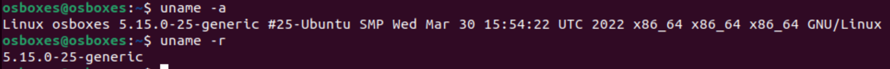
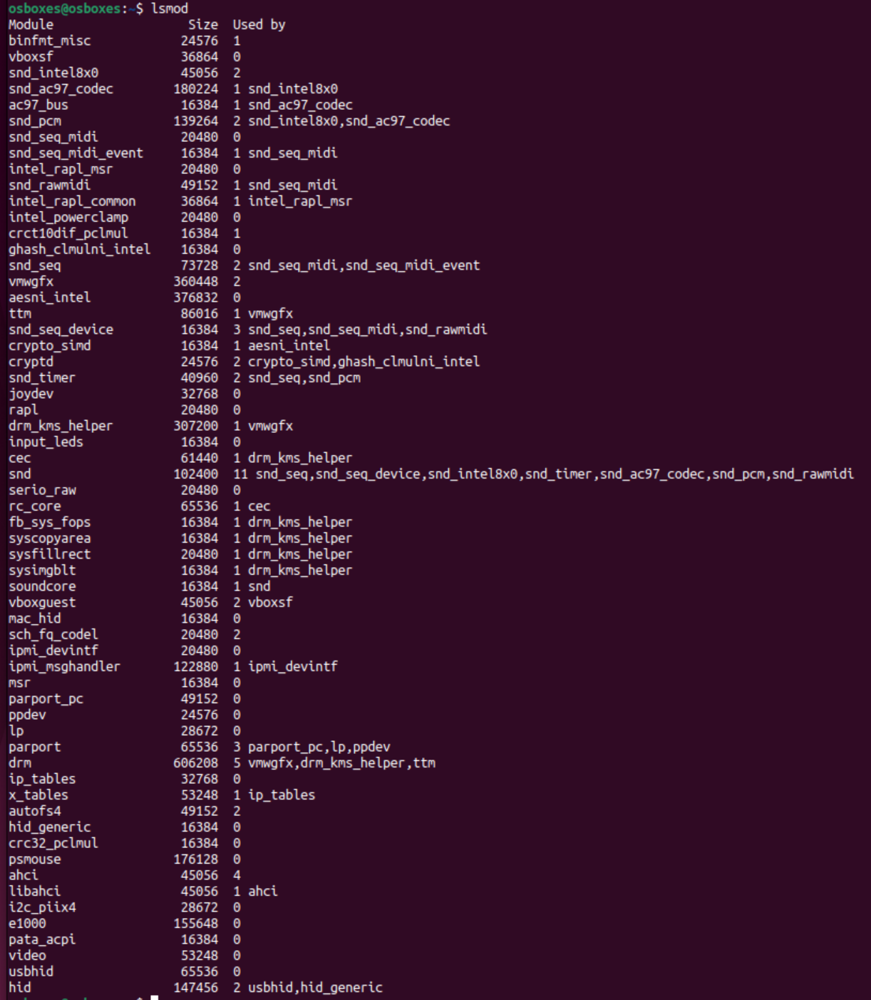
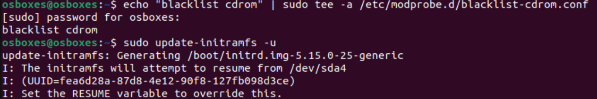
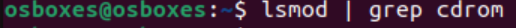
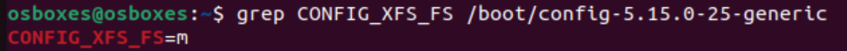
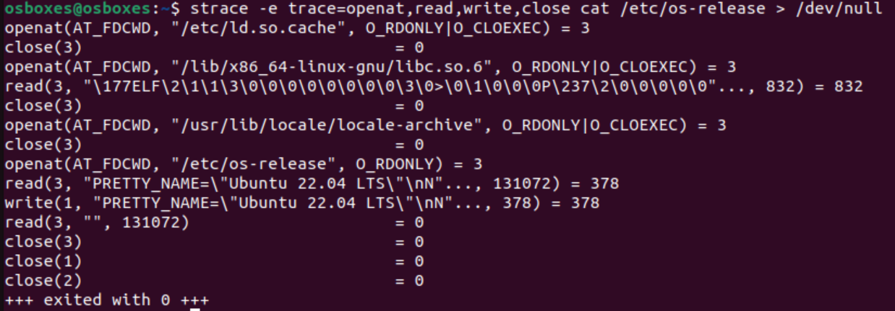

# Домашнее задание 1 (Linux Архитектура и файловые системы)
Выполнил: Целиков Данил

## Задание 1. Kernel and Module Inspection

### Продемонстрировать версию ядра вашей ОС.

```shell
uname -a
```
Для более краткого вывода:
```shell
uname -r
```



### Показать все загруженные модули ядра.

```shell
lsmod
```




### Отключить автозагрузку модуля cdrom.

так как модуль cdrom builtin(встроен в ядро), я не понял как его отключить и в lsmod он не показывается. Но список команд для его отключения представлен ниже  

```shell
echo "blacklist cdrom" | sudo tee /etc/modprobe.d/blacklist-cdrom.conf
sudo update-initramfs -u
sudo reboot
```




### Найти и описать конфигурацию ядра (файл конфигурации, параметр CONFIG_XFS_FS).

```shell
grep CONFIG_XFS_FS /boot/config-$(uname -r)
```



CONFIG_XFS_FS - параметр ядра, который включает поддержку файловой системы XFS

Если значение равно y или m:
* y - поддержка вкомпилирована в ядро
* m - поддержка реализована как загружаемый модуль
* n - поддержка отключена

## Задание 2. Наблюдение за VFS

### Используйте strace для анализа команды cat  /etc/os-release > /dev/null.



### Описать открываемый и читаемый файл, объяснить отсутствие записывающих вызовов в выводе.

`openat(AT_FDCWD, "/etc/ld.so.cache", O_RDONLY|O_CLOEXEC) = 3`  
* Система загружает кэш динамических библиотек для поиска зависимостей программы `cat`

`close(3) = 0`  
* Закрывается файл кэша библиотек после использования

`openat(AT_FDCWD, "/lib/x86_64-linux-gnu/libc.so.6", O_RDONLY|O_CLOEXEC) = 3`  
* Загружается основная библиотека libc, необходимая для работы программы

`read(3, "\177ELF\2\1\1\3\0\0\0\0\0\0\0\0\3\0>\0\1\0\0\0\0\0\237\2\0\0\0\0\0"..., 832) = 832`  
* Читается заголовок исполняемого файла библиотеки (символы `\177ELF` - магическое число ELF)

`close(3) = 0`  
* Закрывается файл библиотеки после загрузки

`openat(AT_FDCWD, "/usr/lib/locale/locale-archive", O_RDONLY|O_CLOEXEC) = 3`  
* Загружаются настройки локализации и языковые стандарты

`close(3) = 0`  
* Закрывается файл локалей после использования

`openat(AT_FDCWD, "/etc/os-release", O_RDONLY) = 3`  
* Открывается файл `/etc/os-release` только для чтения - это основной файл задания

`read(3, "PRETTY_NAME=\"Ubuntu 22.04 LTS\"\nN"..., 131072) = 378`  
* Читается 378 байт данных из файла os-release в буфер размером 131072 байт

`write(1, "PRETTY_NAME=\"Ubuntu 22.04 LTS\"\nN"..., 378) = 378`  
* Данные записываются в stdout (дескриптор 1), но из-за `> /dev/null` они отбрасываются

`read(3, "", 131072) = 0`  
* Чтение возвращает 0 байт - достигнут конец файла

`close(3) = 0`  
* Закрывается файл `/etc/os-release`

`close(1) = 0`  
* Закрывается стандартный вывод (дескриптор 1)

`close(2) = 0`  
* Закрывается стандартный поток ошибок (дескриптор 2)

`+++ exited with 0 +++`  
* Программа успешно завершилась с кодом возврата 0


Почему нет вызовов write? Потому что `> /dev/null перенаправляет стандартный вывод в /dev/null`

## Задание 3. LVM Management

### Добавить к своей виртуальной машине  диск /dev/sdb размером 2GB.

### Создать раздел на /dev/sdb, используя fdisk или parted.

### Создать Physical Volume (PV) на этом разделе.

### Создать Volume Group (VG) с именем vg_highload.

### Создать два Logical Volume (LV): data_lv (1200 MiB) и logs_lv (оставшееся место).

### Отформатировать data_lv как ext4 и примонтировать в /mnt/app_data.

### Отформатировать logs_lv как xfs и примонтировать в /mnt/app_logs.

## Задание 4. Использование pseudo filesystem

### Извлечь из /proc модель CPU и объём памяти (KiB).

### Используя /proc/\$$/status, найдите Parent Process ID (PPid) вашего текущего shell. что означает $$ ?

### Определить настройки I/O scheduler для основного диска /dev/sda.

### Определить размер MTU для основного сетевого интерфейса (например, eth0 или ens33).