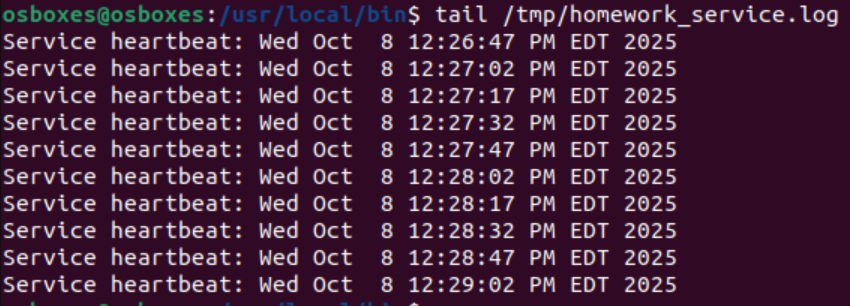

# Домашнее задание 2 (Linux работа с памятью и процессами)

Выполнил: Целиков Данил

## Содержание

1. [Задание 1. Systemd](#задание-1-systemd)

2. [Задание 2. Межпроцессное взаимодействие (IPC) с разделяемой памятью](#задание-2-межпроцессное-взаимодействие-ipc-с-разделяемой-памятью)

3. [Задание 3. Анализ памяти процессов (VSZ vs RSS)](#задание-3-анализ-памяти-процессов-vsz-vs-rss)

4. [Задание 4. NUMA и cgroups](#задание-4-numa-и-cgroups)

## Задание 1. Systemd

### Создайте bash-скрипт /usr/local/bin/homework_service.sh

```shell
bash
#!/bin/bash
echo "My custom service has started."
while true; do
  echo "Service heartbeat: $(date)" >> /tmp/homework_service.log
  sleep 15
done
```


### Создайте systemd unit файл для скрипта, который бы переживал любые обновления системы. Убедитесь, что сервис сам перезапускается в случае падения через 15 секунд.

Создаем unit файл:

```shell
sudo vim /etc/systemd/system/homework_service.service
```

с содержимым:

```
[Unit]
Description=Homework Custom Service
After=network.target

[Service]
Type=simple
ExecStart=/usr/local/bin/homework_service.sh
Restart=always
RestartSec=15
User=root

# Гарантия переживания обновлений системы
[Install]
WantedBy=multi-user.target
```

Обновляем systemd и включаем автозагрузку

```shell
sudo systemctl daemon-reload
sudo systemctl enable homework_service.service
```


### Запустите сервис и убедитесь, что он работает.

Запускаем

```shell
sudo systemctl start homework_service.service
sudo systemctl status homework_service.service
```


Проверяем логи сервиса

```shell
sudo journalctl -u homework_service.service -f
```


Сервис не запускался, потому что не было прав на выполнение. После `chmod +x homework_service.sh` права на исполнение
появились

Проверяем файл с heartbeat сообщениями

```shell
tail /tmp/homework_service.log
```



Проверка перезапуска при падении

```shell
ps aux | grep homework_service
sudo kill -9 11313
sudo systemctl status homework_service.service
sudo journalctl -u homework_service.service -f
```


Как видно на изображении. Сервис перезапустился ровно через 15 секунд:

* в 12:37:02 - убит
* в 12:37:17 - перезапущен

### Используя systemd-analyze, покажите топ-5 systemd unit`ов стартующих дольше всего.

```shell
systemd-analyze blame | head -5
```


## Задание 2. Межпроцессное взаимодействие (IPC) с разделяемой памятью

### Создайте шареную память

```shell
sudo vim shm_creator.c
```

с содержимым:

```c
#include <stdio.h>
#include <stdlib.h>
#include <sys/ipc.h>
#include <sys/shm.h>
#include <unistd.h>
 
int main() {
    key_t key = ftok("homework_key", 65); // Generate a unique key
    int shmid = shmget(key, 1024, 0666|IPC_CREAT); // Create 1KB segment
    if (shmid == -1) {
        perror("shmget");
        exit(1);
    }
    printf("Shared memory segment created.\n");
    printf("ID: %d\nKey: 0x%x\n", shmid, key);
    printf("Run 'ipcs -m' to see it. Process will exit in 60 seconds...\n");
    sleep(60);
    shmctl(shmid, IPC_RMID, NULL); // Clean up
    printf("Shared memory segment removed.\n");
    return 0;
}
```

### Скомпилируйте и запустите

```shell
gcc shm_creator.c -o shm_creator
touch homework_key
./shm_creator
```


### Пока программа запущена (60 секунд), проанализируйте вывод

```shell
ipcs -m
```


* key - ключ, по которому процессы находят общий сегмент памяти
* shmid - идентификатор сегмента разделяемой памяти
* owner - владелец сегмента
* perms - права доступа (0666 в восьмеричной системе)
* bytes - размер сегмента (1024 байта)
* nattch - количество присоединенных процессов
* status - статус сегмента

nattch = 0 - означает, что в данный момент нет процессов, присоединенных к этому сегменту памяти. Это нормально, так как
наша программа создала сегмент, но не присоединилась к нему через `shmat()`

## Задание 3. Анализ памяти процессов (VSZ vs RSS)

### Откройте 1 окно терминала и запустите питон скрипт, который запрашивает 250 MiB памяти и держит ее 2 минуты

```shell
python3 -c "print('Allocating memory...'); a = 'X' * (250 * 1024 * 1024); import time; print('Memory allocated. Sleeping...'); time.sleep(120);"
```

### Пока скрипт запущен, откройте вторую вкладку, найдите там PID запущенного скрипта и проанализируйте использование RSS и VSZ:

```shell
ps aux | grep "python3.*250.*1024"
ps -o pid,user,%mem,rss,vsz,comm -p 2702
```


* VSZ (Virtual Memory Size) - Виртуальный размер памяти
    * 283468 KB - весь объем виртуальной памяти, выделенный процессу
* RSS (Resident Set Size) - Резидентный набор
    * 264044 KB - объем физической памяти, фактически используемый процессом
    * Только те страницы, которые находятся в оперативной памяти сейчас

### Объясните почему vsz больше rss, и почему rss далеко не 0

#### Почему VSZ больше RSS?

Потому что RSS показывает сколько памяти использует процесс(~ 250 Mb).

А VSZ включает в себя RSS + библиотеки, код и т.д.

#### Почему RSS далеко не 0?

Потому что выделенная строка - 'X' * (250 * 1024 * 1024) занимает ~250 MB физической памяти

## Задание 4. NUMA и cgroups

### Продемонстрируйте количество NUMA нод на вашем сервере и количество памяти для каждой NUMA ноды

```shell
numactl --hardware
```


### Убедитесь что вы можете ограничивать работу процессов при помощи systemd и запустите.

```shell
sudo systemd-run --unit=highload-stress-test --slice=testing.slice \
--property="MemoryMax=150M" \
--property="CPUWeight=100" \
stress --cpu 1 --vm 1 --vm-bytes 300M --timeout 30s

sudo systemctl status highload-stress-test
```


### Будет ли работать тест если мы запрашиваем 300М оперативной памяти, а ограничивыем 150М?

Будет, потому что включен swap - вся превышающая память уходит в него

### В соседней вкладке проследите за testing.slice при помощи systemd-cgls. Привысило ли использование памяти 150М ? Что происходит с процессом при превышении? Попробуйте использовать разные значения

```shell
sudo systemd-cgls /testing.slice
systemctl show -p MemoryMax -p MemoryCurrent - p MemorySwapMax highload-stress-test
```


Использование памяти не превысило 150М из-за swap. При других значениях тоже не превысило.

Если запустить тест с property MemorySwapMax=0 и OOMPolicy=kill, то процесс убьется

```shell
sudo systemd-run --unit=strict-memory-test --slice=testing.slice \
--property="MemoryMax=150M" \
--property="MemorySwapMax=0" \
--property="OOMPolicy=kill" \
stress --cpu 1 --vm 1 --vm-bytes 300M --timeout 30s
```


### Опишите что делает и для чего можно использовать MemoryMax and CPUWeight.

MemoryMax - ограничивает максимальное использование оперативной памяти процессом, но без учета swap

* Используется для изоляции сервисов

CPUWeight - определяет относительный приоритет доступа к CPU времени

* Используется в основном для приоритизации процессов в конкуренции за процессорное время 
