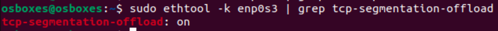

# Домашнее задание 3 (Сетевой стек)

Выполнил: Целиков Данил

## Содержание

1. [Задание 1. Анализ состояний TCP-соединений](#задание-1-анализ-состояний-tcp-соединений)

2. [Задание 2. Динамическая маршрутизация с BIRD](#задание-2-динамическая-маршрутизация-с-bird)

3. [Задание 3. Настройка фаервола/ Host Firewalling](#задание-3-настройка-фаервола-host-firewalling)

4. [Задание 4. Аппаратное ускорение сетевого трафика (offloading)](#задание-4-аппаратное-ускорение-сетевого-трафика-offloading)

## Задание 1. Анализ состояний TCP-соединений

### Запустите Python HTTP сервер на порту 8080

```shell
python3 -m http.server 8080
```


### Проверяйте слушающие TCP-сокеты с помощью утилиты ss. найдите сокет с вашим http сервером.

```shell
ss -tlnp | grep 8080
ss -tan '( sport = :8080 or dport = :8080 )'
```


### Подключитесь к серверу через curl.

```shell
curl -s http://localhost:8080
```


Выполнив curl, увидели корректный ответ

### Проанализируйте состояние TCP-сокетов для порта 8080, объясните, почему есть сокет в состоянии TIME-WAIT, его роль и почему его нельзя удалить.

```shell
ss -tan | grep 8080
```


*Почему есть сокет в состоянии TIME-WAIT?*

TIME-WAIT - это состояние TCP-соединения, в котором находится сторона, инициативно закрывшая соединение (активный
закрыватель), после успешного завершения соединения.

В данном случае сторона инициативно закрывшая соединение это curl. Поэтому есть сокет в состоянии TIME-WAIT

*Роль TIME-WAIT*

* Гарантия доставки последних ACK-пакетов
* Предотвращение смешивания пакетов

*Почему есть сокет в состоянии TIME-WAIT?*

Если удалить сокет сразу:

* Возможны потери финальных ACK-пакетов
* Риск получения старых дублированных пакетов в новых соединениях
* Нарушение надежности TCP-протокола

### Опишите, к каким проблемам может привести большое количество TIME-WAIT сокетов.

* Исчерпание доступных портов для новых исходящих соединений
* Каждый TIME-WAIT сокет занимает ресурсы (CPU и память)
* Увеличение времени установки новых соединений

## Задание 2. Динамическая маршрутизация с BIRD

### Создайте dummy-интерфейс с адресом 192.168.14.88/32, назовите его service_0.

```shell
sudo modprobe dummy
sudo ip link add service_0 type dummy
sudo ip addr add 192.168.14.88/32 dev service_0
sudo ip link set service_0 up
```


### При помощи BIRD проаннонсируйте этот адрес при помощи протокола RIP v2 включенного на вашем интерфейсе (eth0/ens33), а так же любой другой будущий адрес из подсети 192.168.14.0/24 но только если у него будет маска подсети /32 и имя будет начинаться на service_

```shell
sudo systemctl start bird
sudo systemctl enable bird
sudo systemctl status bird
sudo birdc show route
sudo birdc show protocols
ip route show
```

### Создайте ещё три интерфейса

#### service_1 192.168.14.1/30

```shell
sudo ip link add service_1 type dummy
sudo ip addr add 192.168.14.1/30 dev service_1
sudo ip link set service_1 up
```

#### service_2 192.168.10.4/32

```shell
sudo ip link add service_2 type dummy
sudo ip addr add 192.168.10.4/32 dev service_2
sudo ip link set service_2 up
```

#### srv_1 192.168.14.4/32

```shell
sudo ip link add srv_1 type dummy
sudo ip addr add 192.168.14.4/32 dev srv_1
sudo ip link set srv_1 up
```


### С помощью tcpdump докажите, что анонсируются только нужные адреса, без лишних.

```shell
sudo tcpdump -i enp0s3 -n -v port 520
```


## Задание 3. Настройка фаервола/ Host Firewalling

### С помощью iptables или nftables создайте правило, запрещающее подключения к порту 8080.

```shell
sudo iptables -A INPUT -p tcp --dport 8080 -j DROP
sudo iptables -I INPUT 1 -p tcp --dport 8080 -j DROP
sudo iptables -L INPUT -n --line-numbers
```


### Запустите веб сервер на питоне и продемонстрируйте работу вашего firewall при помощи tcpdump.

```shell
python3 -m http.server 8080
sudo tcpdump -i any -nn -v 'port 8080'
```


## Задание 4. Аппаратное ускорение сетевого трафика (offloading)

### С помощью ethtool исследуйте offload возможности вашего сетевого адаптера.

```shell
sudo ethtool -k eth0 | grep -E "*offload"
```


### Покажите включён ли TCP segmentation offload.

```shell
sudo ethtool -k eth0 | grep tcp-segmentation-offload
```



Включен

### Объясните, какую задачу решает TCP segmentation offload.

TCP segmentation offload (TSO) - это технология, которая передает задачу сегментации больших TCP-пакетов с центрального
процессора на сетевой адаптер

Суть TCP segmentation offload (TSO) в том, чтобы переложить работу по подготовке сетевых пакетов с процессора на сетевую
карту. Вместо того чтобы создавать множество мелких пакетов, операционная система отправляет один большой блок данных.
Сетевой контроллер сам "нарезает" его, добавляет служебную информацию и отправляет. Это разгружает процессор и ускоряет
передачу данных
